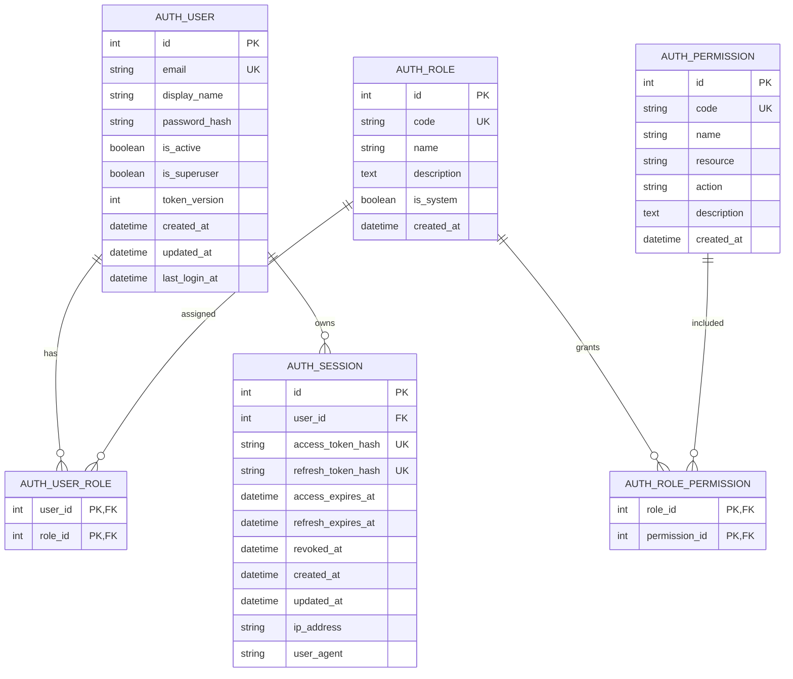

# 用户注册与权限数据库设计说明

> 文档日期：2026-09-04  
> 适用范围：`ai-service/app/auth` 当前实现  
> 权限模型：RBAC（Role-Based Access Control，基于角色的访问控制）

## 1. 文档目的

本文档梳理当前项目中与用户注册、登录会话、角色和权限相关的数据库表，以及新用户注册时的数据流转过程。

当前权限系统已经具备“用户—角色—权限”的基础结构，但业务接口目前主要执行登录校验，尚未全面执行细粒度权限校验。此外，知识库数据尚未与用户建立所有权关系。

## 2. 整体关系



## 3. 数据表说明

### 3.1 `auth_user`：用户表

保存用户账号及状态，不直接保存角色和权限。

| 字段 | 类型 | 约束 | 说明 |
|---|---|---|---|
| `id` | Integer | 主键 | 用户唯一标识 |
| `email` | String(320) | 唯一、非空、索引 | 登录邮箱，写入前会转为小写并去除两端空格 |
| `display_name` | String(100) | 非空 | 用户显示名称 |
| `password_hash` | String(255) | 非空 | bcrypt 密码哈希，不保存明文密码 |
| `is_active` | Boolean | 非空，默认 `true` | 是否允许登录和继续使用会话 |
| `is_superuser` | Boolean | 非空，默认 `false` | 超级管理员标记；为真时跳过角色权限检查 |
| `token_version` | Integer | 非空，默认 `1` | Token 版本预留字段 |
| `created_at` | DateTime | 非空 | 创建时间 |
| `updated_at` | DateTime | 非空 | 更新时间 |
| `last_login_at` | DateTime | 可空 | 最近一次密码登录时间 |

关系：

- 通过 `auth_user_role` 与角色形成多对多关系。
- 与 `auth_session` 形成一对多关系。
- 删除用户时，其角色关联和会话会级联删除。

### 3.2 `auth_role`：角色表

角色是一组权限的集合。

| 字段 | 类型 | 约束 | 说明 |
|---|---|---|---|
| `id` | Integer | 主键 | 角色唯一标识 |
| `code` | String(80) | 唯一、非空、索引 | 程序使用的角色代码 |
| `name` | String(100) | 非空 | 角色显示名称 |
| `description` | Text | 可空 | 角色说明 |
| `is_system` | Boolean | 非空，默认 `true` | 是否为系统角色 |
| `created_at` | DateTime | 非空 | 创建时间 |

当前系统初始化两个角色：

| 角色代码 | 名称 | 用途 |
|---|---|---|
| `admin` | 管理员 | 拥有当前定义的全部权限 |
| `member` | 普通成员 | 自助注册用户的默认角色 |

### 3.3 `auth_permission`：权限表

权限使用 `资源.动作` 形式的代码表示。

| 字段 | 类型 | 约束 | 说明 |
|---|---|---|---|
| `id` | Integer | 主键 | 权限唯一标识 |
| `code` | String(120) | 唯一、非空、索引 | 权限代码，例如 `knowledge.read` |
| `name` | String(120) | 非空 | 权限名称 |
| `resource` | String(80) | 非空 | 资源类型，例如 `knowledge` |
| `action` | String(40) | 非空 | 操作类型，例如 `read` |
| `description` | Text | 可空 | 权限说明 |
| `created_at` | DateTime | 非空 | 创建时间 |

当前权限清单：

| 权限代码 | 名称 | 资源 | 动作 |
|---|---|---|---|
| `chat.use` | 使用 AI 对话 | `chat` | `use` |
| `knowledge.read` | 读取知识库 | `knowledge` | `read` |
| `knowledge.write` | 维护知识库 | `knowledge` | `write` |
| `knowledge.manage` | 管理知识库权限 | `knowledge` | `manage` |
| `agent.use` | 使用 Agent | `agent` | `use` |
| `agent.manage` | 管理 Agent | `agent` | `manage` |
| `mcp.use` | 使用 MCP 工具 | `mcp` | `use` |
| `mcp.manage` | 管理 MCP 工具 | `mcp` | `manage` |

### 3.4 `auth_user_role`：用户角色关联表

连接用户和角色，支持一个用户拥有多个角色。

| 字段 | 类型 | 约束 | 说明 |
|---|---|---|---|
| `user_id` | Integer | 联合主键、外键 | 指向 `auth_user.id` |
| `role_id` | Integer | 联合主键、外键 | 指向 `auth_role.id` |

两个字段共同构成主键，可以防止同一角色被重复分配给同一用户。

### 3.5 `auth_role_permission`：角色权限关联表

连接角色和权限，支持一个角色拥有多个权限，同一权限也可以被多个角色使用。

| 字段 | 类型 | 约束 | 说明 |
|---|---|---|---|
| `role_id` | Integer | 联合主键、外键 | 指向 `auth_role.id` |
| `permission_id` | Integer | 联合主键、外键 | 指向 `auth_permission.id` |

### 3.6 `auth_session`：用户会话表

保存登录会话。服务端只保存令牌的 SHA-256 哈希，不保存浏览器持有的原始令牌。

| 字段 | 类型 | 约束 | 说明 |
|---|---|---|---|
| `id` | Integer | 主键 | 会话唯一标识 |
| `user_id` | Integer | 外键、非空、索引 | 会话所属用户 |
| `access_token_hash` | String(64) | 唯一、非空、索引 | 访问令牌哈希 |
| `refresh_token_hash` | String(64) | 唯一、非空、索引 | 刷新令牌哈希 |
| `access_expires_at` | DateTime | 非空 | 访问令牌过期时间 |
| `refresh_expires_at` | DateTime | 非空 | 刷新令牌过期时间 |
| `revoked_at` | DateTime | 可空、索引 | 会话撤销时间；非空表示已失效 |
| `created_at` | DateTime | 非空 | 创建时间 |
| `updated_at` | DateTime | 非空 | 更新时间 |
| `ip_address` | String(64) | 可空 | 登录来源 IP |
| `user_agent` | String(512) | 可空 | 浏览器或客户端信息 |

## 4. 默认角色权限矩阵

| 权限 | `admin` | `member` |
|---|:---:|:---:|
| `chat.use` | ✓ | ✓ |
| `knowledge.read` | ✓ | ✓ |
| `knowledge.write` | ✓ | ✓ |
| `knowledge.manage` | ✓ | — |
| `agent.use` | ✓ | ✓ |
| `agent.manage` | ✓ | — |
| `mcp.use` | ✓ | ✓ |
| `mcp.manage` | ✓ | — |

此外，`auth_user.is_superuser = true` 的用户会绕过 `require_permissions` 和 `require_roles` 检查。

## 5. 自助注册写入流程

用户提交名称、邮箱和密码后，`POST /auth/register` 按以下顺序处理：

```text
校验名称、邮箱和密码
        ↓
规范化邮箱和显示名称
        ↓
检查邮箱是否已经存在
        ↓
读取 member 角色
        ↓
bcrypt 计算密码哈希
        ↓
写入 auth_user
        ↓
写入 auth_user_role
        ↓
生成访问令牌和刷新令牌
        ↓
令牌哈希写入 auth_session
        ↓
原始刷新令牌写入 HttpOnly Cookie
```

注册接口固定使用：

```python
role_code = "member"
is_superuser = False
```

客户端不能通过注册参数指定管理员角色或超级管理员状态。

### 注册成功后的典型数据

以下内容仅用于说明表之间的关系：

```text
auth_user
  id = 10
  email = learner@example.com
  display_name = Learner
  password_hash = <bcrypt hash>
  is_active = true
  is_superuser = false

auth_user_role
  user_id = 10
  role_id = <member role id>

auth_session
  user_id = 10
  access_token_hash = <sha256 hash>
  refresh_token_hash = <sha256 hash>
```

## 6. 登录与权限判断过程

### 6.1 身份认证

受保护请求携带访问令牌后，后端执行：

1. 对访问令牌计算 SHA-256 哈希。
2. 在 `auth_session` 中查找对应会话。
3. 检查会话是否撤销或过期。
4. 检查关联用户是否启用。
5. 返回当前用户。

### 6.2 权限授权

后端已经提供两种依赖：

```python
require_permissions("knowledge.write")
require_roles("admin")
```

权限判断规则：

1. 超级管理员直接通过。
2. 普通用户从所有角色中合并权限。
3. `require_permissions` 要求用户包含全部指定权限。
4. `require_roles` 要求用户至少拥有一个指定角色。
5. 不满足要求时返回 HTTP 403。

## 7. 当前实现边界与风险

### 7.1 知识库写接口已绑定权限

知识库上传、新增、修改和删除接口已绑定 `knowledge.write`；member 默认拥有该权限。聊天、标题、Chunk 调试和检索调试路由仍统一使用 `get_current_user`，只验证用户是否登录。

其他业务接口后续如需更细粒度控制，仍需按资源绑定 `require_permissions` 或 `require_roles`。

### 7.2 知识库已按用户隔离

`knowledge_base`、`knowledge_file` 和 `knowledge_chunk` 已增加 `user_id`。知识库 API 的列表、详情、Chunk、更新和删除查询均按当前用户过滤，父节点与上传文件关联也会校验所有权；Chroma metadata 同步写入 `user_id`。

### 7.3 `token_version` 尚未参与会话失效判断

`auth_user.token_version` 已存在，但当前会话校验主要依赖 `auth_session.revoked_at` 和过期时间。如果未来需要“一键退出全部设备”或修改密码后强制所有旧会话失效，可以将该字段纳入会话校验，或者批量撤销用户会话。

### 7.4 表结构变更缺少正式迁移

当前项目通过 SQLAlchemy `create_all` 创建不存在的表，并在启动时兼容性补充旧知识表的 `user_id` 和索引。该方式只适合当前简单迁移；后续增加工作空间或审计字段时，建议引入 Alembic 管理数据库迁移。

## 8. 面向个人知识库产品的建议调整

第一版个人学习产品建议采用“用户拥有自己的知识库”的模型：

1. 为知识库相关数据增加用户所有权字段。
2. 普通成员增加 `knowledge.write` 权限。
3. 读取接口绑定 `knowledge.read`。
4. 上传、新增、修改和删除接口绑定 `knowledge.write`。
5. 每次知识库查询同时验证权限和资源所有权。
6. Chroma 向量 metadata 写入 `user_id`，检索时强制过滤当前用户。

建议目标关系：

```text
auth_user
    └── knowledge_base
            └── knowledge_file
                    └── knowledge_chunk
```

后续扩展企业版本时，可以将直接的 `user_id` 所有权升级为 `workspace_id`：个人用户拥有个人工作空间，企业用户加入企业工作空间。这样无需推翻知识库、思维导图和视频生成流程。

## 9. 代码来源

| 内容 | 文件 |
|---|---|
| 用户、角色、权限、会话模型 | `app/auth/models.py` |
| 默认角色、权限与用户创建 | `app/auth/service.py` |
| 注册、登录、刷新和退出接口 | `app/auth/router.py` |
| 身份认证与权限依赖 | `app/auth/dependencies.py` |
| 密码和令牌哈希 | `app/auth/security.py` |
| 认证配置 | `app/auth/config.py` |
